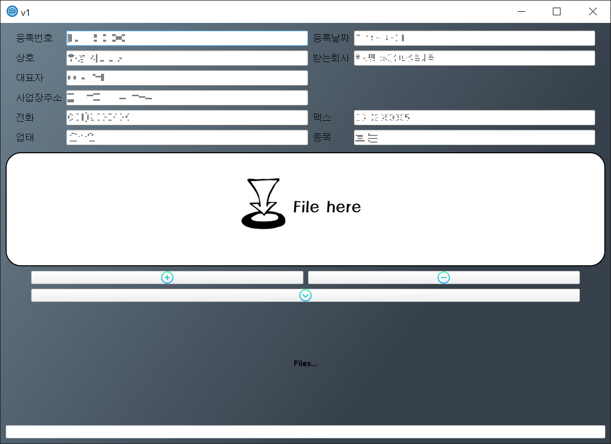

## Excel2Word

### 개요
(거래내역서) 엑셀 파일을 워드 파일로 변환한다.

 

### 구조
- `run.py` : 메인 파일
- `handle_word.py` : word 파일 생성 (excel 데이터 조회 -> word 템플릿에 맞춰 데이터 가공/삽입)
- `handle_window.py` : window 위젯 관리

 

### 환경 (with libraries)
- Python3
- PyQt5
- MailMerge

 

### 이미지

 

### Date
- 2019.10.15

  
