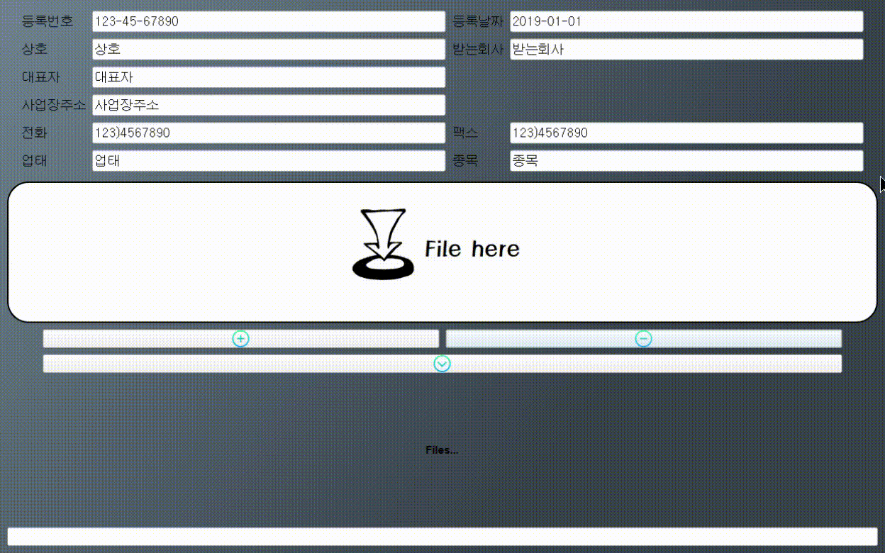

# Excel2Word

### About
거래내역서 엑셀 파일을 워드 파일로 변환합니다.

 

### Files
- `run.py` : 메인 파일입니다.
- `handle_word.py` : (생성될) word 파일과 관련된 파일입니다.
- `handle_window.py` : window 위젯과 관련된 파일입니다.

 

### Env (with libraries)
- Python3
- PyQt5
- MailMerge

 

### Example

 

### Date
- 2019.10.15

  

*Readme 최종 수정일: 2020-09-07*
